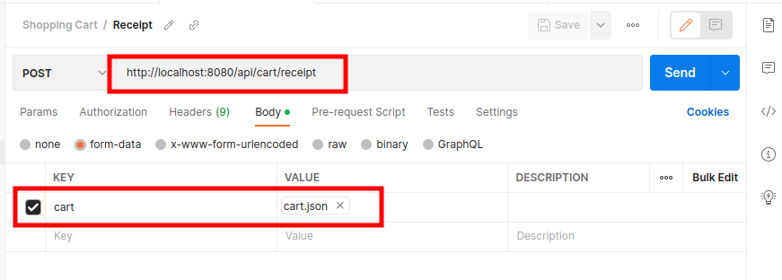

# shopping-cart-spring-boot
Backend project for Shopping Cart application

## Prerequisite

1. Java 17+
2. Maven

### Run the app

1. Open the current project root folder in CLI
2. To create the build, run the following command :
    **mvn clean install**
3. This will generate a JAR file in target folder
4. Go to the target folder and run the following command to start the application:
   **java -jar shopping-cart-0.0.1-SNAPSHOT.jar**
    

### How to access the backend app via Postman?
1. Open Postman
2. Import the Postman collection present in the root folder named as "**cart-postman-collection.json**"
4. **(Refer the below image for reference)** Go to the "**Receipt**" endpoint and replace the file (cart.json) with the file present in the root folder of this project. Click on the Send button to see the results of the API

